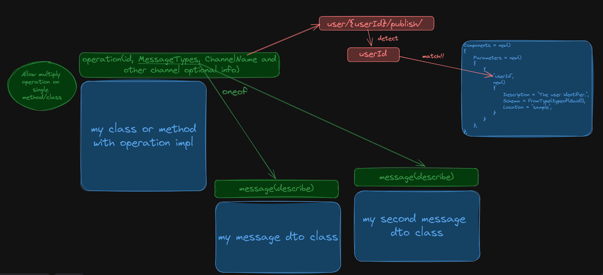

# AsyncApi.Net

Is an [AsyncAPI](https://github.com/asyncapi/asyncapi) documentation generator for dotnet.

ℹ Note that pre version 1.0.0, the API is regarded as unstable and **breaking changes may be introduced**.

This is a fork of the [Sauner library](https://github.com/m-wild/saunter/tree/main), which was rewritten for the sake of ease of use and minimizing the cost of implementation in the project.

## Simple start

1. Install package from nuget - `TODO: add link`
2. Configure base generator params in `Program.cs`:

    ```csharp
       services.AddAsyncApiSchemaGeneration(o =>
        {
            o.AssemblyMarkerTypes = new[] { typeof(StreetlightsController) }; // add assemply marker
            o.AsyncApi = new AsyncApiDocument { Info = new Info { Title = "My application" }}; // introduce your application
        });
    ```

3. Map generator and ui in `Program.cs`:

    ```csharp
    app.MapAsyncApiDocuments();
    app.MapAsyncApiUi();
    ```

4. Set attributes to pub/sub methods or classes:

    ```csharp
    [PublishOperation<MyPayloadMessageType>("my_queue_name")]
    [PublishOperation<MyPayloadMessageType, MySecondPayloadMessageType>("my_queue_second_name")]
    public void MyMethod()
    ```

5. Run application, open endpoint `/asyncapi/ui/` and view:

    

## Usage docs

The overall concept looks like the following:

1. Add attributes containing information about channels and operations to methods or classes that implement them.
2. Optionally, provide additional information about messages using attributes on the DTO (Data Transfer Object) type representing the message.
3. The generator will consolidate all this information, mapping messages to operations where they are used, and generating channel parameters when detected.



### DI Configure

You can configure the basic document parameters and generator operation in the `Program.cs` file.

The `AddAsyncApiSchemaGeneration` method is used to add the generator, JSON serializer, and generator provider to the DI (Dependency Injection) container.

The method also takes an optional parameter `setupAction`, which is used to customize the library settings.

With it, you can configure:

* The basic document prototype, where information about the application, its version (default is 'latest'), list of servers, channel bindings, and any other document fields will be specified.
* A list of types to be used as assembly markers.
* A list of filters implementing the `IDocumentFilter` interface to apply to the generated document.
* A list of filters implementing the `IOperationFilter` interface to apply to the operations of the generated document.
* Settings for the JSON generator, inherited from the `JsonSchemaGeneratorSettings` class in the `NJsonSchema` library.
* Middleware parameters:
  * Document endpoint (default is '/asyncapi/asyncapi.json').
  * UI endpoint (default is '/asyncapi/ui/').
  * UI title (default is 'AsyncAPI').

Example:

```csharp
services.AddAsyncApiSchemaGeneration(o =>
{
    o.AssemblyMarkerTypes = new[] { typeof(StreetlightMessageBus) };
    o.Middleware.UiTitle = "Streetlights API";
    o.AsyncApi = new AsyncApiDocument
    {
        Info = new Info
        {
            Title = "Streetlights API",
            Description = "The Smartylighting Streetlights API allows you to remotely manage the city lights.",
            License = new License
            {
                Name = "Apache 2.0",
                Url = "https://www.apache.org/licenses/LICENSE-2.0"
            }
        },
        Servers = new()
        {
            ["mosquitto"] = new Server
            {
                Url = "test.mosquitto.org",
                Protocol = "mqtt",
            },
            ["webapi"] = new Server
            {
                Url = "localhost:5000",
                Protocol = "http",
            },
        },
    };
});
```

Additionally, to make it work, you need to add middleware and endpoints:

```csharp
app.MapAsyncApiDocuments();
app.MapAsyncApiUi();
```

### Operation attribute

The generator uses the `PublishOperation` and `SubscribeOperation` attributes as data sources, which can be added to any class/interface/method in any desired quantity with two constraints:

1. The channel name must be unique.
2. The operation ID must be unique.

If the application has multiple subscribers to one channel, use the `oneOf` messages, for example:

```csharp
[PublishOperation<LightMeasuredEvent, LightMeasuredEvent2, LightMeasuredEvent3>("PublishLightMeasuredTopic")]
```

Or:

```csharp
[PublishOperation("PublishLightMeasuredTopic", new TypeInfo[] { typeof(LightMeasuredEvent), typeof(LightMeasuredEvent2), typeof(LightMeasuredEvent3), typeof(LightMeasuredEvent4) } )]
```

Unfortunately, this is a limitation of the AsyncAPI specification, which should be addressed in version 3.

Additionally, when specifying the attribute, you can provide various parameters for both the operation and the channel to which this operation belongs.

Channel parameters:

* `ChannelName` - The name of the channel. The format depends on the conventions of the underlying messaging protocol. For example, AMQP uses dot-separated paths like 'light.measured'.
* `ChannelDescription` - An optional description of this channel item. CommonMark syntax can be used for rich text representation.
* `ChannelBindingsRef` - The name of a channel bindings item to reference. The bindings must be added to `components/channelBindings` with the same name.
* `ChannelServers` - The servers on which this channel is available, specified as an optional unordered list of names (string keys) of Server Objects defined in the Servers Object.

Operation parameters:

* `MessagePayloadTypes` - Message schema mark ID for matching with the message attribute. Can be specified as a generic.
* `Summary` - A short summary of what the operation is about.
* `OperationId` - Unique string used to identify the operation. The id MUST be unique among all operations described in the API. The `operationId` value is case-sensitive. Tools and libraries MAY use the `operationId` to uniquely identify an operation, therefore, it is RECOMMENDED to follow common programming naming conventions.
* `Description` - A verbose explanation of the operation. CommonMark syntax can be used for rich text representation.
* `BindingsRef` - The name of an operation bindings item to reference. The bindings must be added to `components/operationBindings` with the same name.
* `Tags` - A list of tags for API documentation control. Tags can be used for logical grouping of operations.
* `DocumentName` - Name of the AsyncAPI document. More details are available in the section on multiple documents in one application.

Examples:

```csharp
[PublishOperation<AnotherSampleMesssage>("asw.sample_service.anothersample", OperationId = "AnotherSampleMessagePublisher", Summary = "Publish another sample.", ChannelDescription = "Another sample events.")]
[PublishOperation<SampleMessage>("messaging.sample", Summary = "Publish a sample message.", OperationId = "PublishSampleMessage", Description = "Publishes a sample message for demonstration purposes.", BindingsRef = "amqpBinding", Tags = new[] { "Messaging", "Publishing" })]
```

In case the channel name contains the `{*}` construction, for example, `qwerty.{my_id}.event`, the generator will create a channel parameter. It will then attempt to find its description and schema in the components. By default, the schema `string` and an empty description are used.

Example:

```csharp
AsyncApiOptions options = new()
{
    AsyncApi = new()
    {
        Info = new()
        {
            Version = "1.0.0",
            Title = GetType().FullName,
        },
        Components = new()
        {
            Parameters = new()
            {
                {
                    "tenant_id",
                    new()
                    {
                        Description = "The tenant identifier.",
                        Schema = NJsonSchema.JsonSchema.FromType(typeof(string)),
                        Location = "tester",
                    }
                }
            },
        },
    },
};

// ...

[SubscribeOperation<TenantCreated>("asw.tenant_service.{tenant_id}.{tenant_status}", OperationId = "OneTenantMessageConsumer", Summary = "Subscribe to domains events about a tenant.", ChannelDescription = "A tenant events.")]
```

### Message attributes

To add parameters to a message, the `MessageAttribute` is used.

It is applied to the DTO class or interface, where message parameters are specified:

* `HeadersType` - The type used to generate the message headers schema.
* `Name` - A machine-friendly name for the message. Defaults to the generated schemaId.
* `Title` - A human-friendly title for the message.
* `Summary` - A brief summary of what the message is about.
* `Description` - A detailed explanation of the message. CommonMark syntax can be used for rich text representation.
* `BindingsRef` - The name of a message bindings item to reference. The bindings must be added to `components/messageBindings` with the same name.
* `MessageId` - A unique string used to identify the message. The id MUST be unique among all messages described in the API. The `messageId` value is case-sensitive. Tools and libraries MAY use the `messageId` to uniquely identify a message, therefore, it is RECOMMENDED to follow common programming naming conventions.
* `Tags` - A list of tags for API documentation control. Tags can be used for logical grouping of messages.

Example:

```csharp
[Message(HeadersType = typeof(MyMessageHeader), Title = "hello world")]
public record MyEvent(string content);
```

## Roadmap

The current implementation has 3 goals.

* Ease of implementation in any project without limitation
* Providing an opportunity to describe any complex scheme
* Support for the current version `asyncapi`(with the possibility of updating to 3.0.0 after release)

### 1 priority

The main purpose of the stage works is to make it possible to describe an operation in 1 attribute without restrictions on the number of operations per method/class

* [X] To dotnet 7
* [X] To asyncapi 2.6.0
* [X] Set required and nullable props to schema
* [X] Give the opportunity to work with multiple operations in the one class/method
* [X] Kill channel attribute:

    ```csharp
    [SubscribeOperation("asw.tenant_service.tenants_history", OperationId = "TenantMessageConsumer", Summary = "Subscribe to domains events about tenants.", ChannelDescription = "Tenant events.")]
    public void PublishHelloWord(string content) { }
    ```

* [X] Rework message attribute:

    ```csharp
    [SubscribeOperation<BrokerHelloWorldDto>("asw.tenant_service.tenants_history", OperationId = "TenantMessageConsumer", Summary = "Subscribe to domains events about tenants.", ChannelDescription = "Tenant events.")]
    public void PublishHelloWord(string content) { }
    ```

    ```csharp
    [Message(Title = "Hello world, i`m class")]
    public record BrokerHelloWorldDto(string content);
    ```

* [X] Kill channel params attribute (auto detect parameters from channel name)

    ```csharp
    [SubscribeOperation<BrokerHelloWorldDto>("asw.tenant_service.{tenants_name}", OperationId = "TenantMessageConsumer")]
    public record BrokerHelloWorldDto(string content);
    ```

* [X] Redo the processing of multiple documents in the application (save default document with `null` name!!)

    ```csharp
    [SubscribeOperation<BrokerHelloWorldDto>("asw.tenant_service.{tenants_name}", OperationId = "TenantMessageConsumer", DocumentName = "Foo")]
    [SubscribeOperation<BrokerHelloWorldDto>("asw.tenant_service.{tenants_name}", OperationId = "TenantMessageConsumer")]
    public record BrokerHelloWorldDto(string content);
    ```

* [ ] Rewrite usage docs:
  * [X] Fast start guide
  * [X] Description of the basic config in di
  * [X] Description of the operation attribute (+ description of working with channel parameters)
  * [X] Description of the message attribute
  * [ ] Description of working with multiple documents
  * [ ] Description of the binding setup
  * [ ] Description of the json parser setup
* [ ] Nuget package
* [ ] Usability test on my environment
* [ ] Release !!

Known limitations of the version that will be received at this stage:

* There is no support for description and location for channel parameters from attributes (only from components ref)

### 2 priority

The main goal of the stage works is to expand the automatically generated part of the schema through xml-comments and improve the quality of the product

* [ ] Add generator output model validation
* [ ] Add xml-comments to output model
* [ ] Add `yaml` output document
* [ ] Rework and enrich unit tests
* [ ] Rework and enrich component tests with `TestHost`

### 3 priority

The main goal of this stage is to refine the remaining features of the async api (such as binding protocol) and develop a tool for describing detailed and complex schemes (without using attributes)

* [ ] Make a normal tool for describing a any complex asyncapi document (without attributes, static method on interface?....)
* [ ] Rework the binding protocols (now it's done terribly)

### 4 priority

The main goal of this stage is to automatically generate part of the scheme from native library objects for the protocols I use (`nats`, `signalR`)

* [ ] To dotnet 8
* [ ] Native work with `nats`
* [ ] Native work with `signalR`
* [ ] Native work with `swagger` (or wait asyncapi 3.0.0 ...?)

## Legacy docs

See [StreetlightsAPI](https://github.com/yurvon-screamo/asyncapi.net/tree/main/examples/StreetlightsAPI) as example.

1. In the `ConfigureServices` method of `Startup.cs`, configure Saunter.

    ```csharp
    // Add generator to the application services. 
    services.AddAsyncApiSchemaGeneration(options =>
    {   
        // Specify example type(s) from assemblies to scan.
        options.AssemblyMarkerTypes = new[] {typeof(StreetlightMessageBus)};

        // Build as much (or as little) of the AsyncApi document as you like.
        // Saunter will generate Channels, Operations, Messages, etc, but you
        // may want to specify Info here.
        options.AsyncApi = new AsyncApiDocument
        {
            Info = new Info("Streetlights API", "1.0.0")
            {
                Description = "The Smartylighting Streetlights API allows you\nto remotely manage the city lights.",
                License = new License("Apache 2.0")
                {
                    Url = "https://www.apache.org/licenses/LICENSE-2.0"
                }
            },
            Servers =
            {
                { "mosquitto", new Server("test.mosquitto.org", "mqtt") }
            }
        };
    });
    ```

2. Add attributes to your classes which publish or subscribe to messages.

    ```csharp
    [AsyncApi] // Tells Saunter to scan this class.
    public class StreetlightMessageBus : IStreetlightMessageBus
    {
        [Channel("publish/light/measured")] // Creates a Channel
        [PublishOperation(typeof(LightMeasuredEvent), Summary = "Inform about environmental lighting conditions for a particular streetlight.")] // A simple Publish operation.
        public void PublishLightMeasuredEvent(Streetlight streetlight, int lumens) {}
    ```

3. Add saunter middleware to host the AsyncApi json document. In the `Configure` method of `Startup.cs`:

    ```csharp
    app.UseEndpoints(endpoints =>
    {
        endpoints.MapAsyncApiDocuments();
        endpoints.MapAsyncApiUi();
    });
    ```

4. Use the published AsyncApi document:

    ```jsonc
    // HTTP GET /asyncapi/asyncapi.json
    {
        // Properties from Startup.cs
        "asyncapi": "2.1.0",
        "info": {
            "title": "Streetlights API",
            "version": "1.0.0",
            "description": "The Smartylighting Streetlights API allows you\nto remotely manage the city lights.",
           // ...
        },
        // Properties generated from Attributes
        "channels": {
            "light/measured": {
            "publish": {
                "operationId": "PublishLightMeasuredEvent",
                "summary": "Inform about environmental lighting conditions for a particular streetlight.",
            //...
    }
    ```

5. Use the published AsyncAPI UI:

    

## Configuration

See [the options source code](https://github.com/tehmantra/saunter/blob/main/src/Saunter/AsyncApiOptions.cs) for detailed info.

Common options are below:

```c#
services.AddAsyncApiSchemaGeneration(options =>
{
    options.AssemblyMarkerTypes = new[] { typeof(Startup) };   // Tell Saunter where to scan for your classes.
    
    options.AddChannelItemFilter<MyChannelItemFilter>();       // Dynamically update ChanelItems
    options.AddOperationFilter<MyOperationFilter>();           // Dynamically update Operations
    
    options.Middleware.Route = "/asyncapi/asyncapi.json";      // AsyncAPI JSON document URL
    options.Middleware.UiBaseRoute = "/asyncapi/ui/";          // AsyncAPI UI URL
    options.Middleware.UiTitle = "My AsyncAPI Documentation";  // AsyncAPI UI page title
}
```

## JSON Schema Settings

The JSON schema generation can be customized using the `options.JsonSchemaGeneratorSettings`. Saunter defaults to the popular `camelCase` naming strategy for both properties and types.

For example, setting to use PascalCase:

```c#
services.AddAsyncApiSchemaGeneration(options =>
{
    options.JsonSchemaGeneratorSettings.TypeNameGenerator = new DefaultTypeNameGenerator();

    // Note: need to assign a new JsonSerializerSettings, not just set the properties within it.
    options.JsonSchemaGeneratorSettings.SerializerSettings = new JsonSerializerSettings 
    {
        ContractResolver = new DefaultContractResolver(),
        Formatting = Formatting.Indented;
    };
}
```

You have access to the full range of both [NJsonSchema](https://github.com/RicoSuter/NJsonSchema) and [JSON.NET](https://github.com/JamesNK/Newtonsoft.Json) settings to configure the JSON schema generation, including custom ContractResolvers.

## Bindings

Bindings are used to describe protocol specific information. These can be added to the AsyncAPI document and then applied to different components by setting the `BindingsRef` property in the relevant attributes `[OperationAttribute]`, `[MessageAttribute]`, `[ChannelAttribute]`

```csharp
// Startup.cs
services.AddAsyncApiSchemaGeneration(options =>
{
    options.AsyncApi = new AsyncApiDocument
    {
        Components = 
        {
            ChannelBindings = 
            {
                ["my-amqp-binding"] = new ChannelBindings
                {
                    Amqp = new AmqpChannelBinding
                    {
                        Is = AmqpChannelBindingIs.RoutingKey,
                        Exchange = new AmqpChannelBindingExchange
                        {
                            Name = "example-exchange",
                            VirtualHost = "/development"
                        }
                    }
                }
            }
        }
    }
});
```

```csharp
[Channel("light.measured", BindingsRef = "my-amqp-binding")] // Set the BindingsRef property
public void PublishLightMeasuredEvent(Streetlight streetlight, int lumens) {}
```

Available bindings:

* [AMQP](https://github.com/tehmantra/saunter/tree/main/src/Saunter/AsyncApiSchema/v2/Bindings/Amqp)
* [HTTP](https://github.com/tehmantra/saunter/tree/main/src/Saunter/AsyncApiSchema/v2/Bindings/Http)
* [Kafka](https://github.com/tehmantra/saunter/tree/main/src/Saunter/AsyncApiSchema/v2/Bindings/Kafka)
* [MQTT](https://github.com/tehmantra/saunter/tree/main/src/Saunter/AsyncApiSchema/v2/Bindings/Mqtt)

## Multiple AsyncAPI documents

You can generate multiple AsyncAPI documents by using the `ConfigureNamedAsyncApi` extension method.

```cs
// Startup.cs

// Add Saunter to the application services. 
services.AddAsyncApiSchemaGeneration(options =>
{
    // Specify example type(s) from assemblies to scan.
    options.AssemblyMarkerTypes = new[] {typeof(FooMessageBus)};
}

// Configure one or more named AsyncAPI documents
services.ConfigureNamedAsyncApi("Foo", asyncApi => 
{
    asyncApi.Info = new Info("Foo API", "1.0.0");
    // ...
});

services.ConfigureNamedAsyncApi("Bar", asyncApi => 
{
    asyncApi.Info = new Info("Bar API", "1.0.0");
    // ...
});
```

Classes need to be decorated with the `AsyncApiAttribute` specifying the name of the AsyncAPI document.

```cs
[AsyncApi("Foo")]
public class FooMessageBus 
{
    // Any channels defined in this class will be added to the "Foo" document
}


[AsyncApi("Bar")]
public class BarMessageBus 
{
    // Any channels defined in this class will be added to the "Bar" document
}
```

Each document can be accessed by specifying the name in the URL

```json
// GET /asyncapi/foo/asyncapi.json
{
    "info": {
        "title": "Foo API"
    }
}

// GET /asyncapi/bar/asyncapi.json
{
    "info": {
        "title": "Bar API"
    }
}
```

## Contributing

See our [contributing guide](https://github.com/tehmantra/saunter/blob/main/CONTRIBUTING.md/CONTRIBUTING.md).

Feel free to get involved in the project by opening issues, or submitting pull requests.

You can also find me on the [AsyncAPI community slack](https://asyncapi.com/slack-invite).

## Thanks

* This project is heavily inspired by [Swashbuckle](https://github.com/domaindrivendev/Swashbuckle.AspNetCore).
* We use [NJsonSchema](https://github.com/RicoSuter/NJsonSchema) for the JSON schema heavy lifting,
